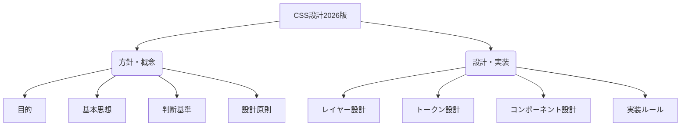

# CSS設計2026版 ドキュメント構成

このリポジトリは、汎用的に使えるCSS設計ルールを定義したドキュメント群です。

## ドキュメント関係図

## 各ドキュメントへのリンク

- [index.md](index.md): 全体の構成と役割の一覧です。
- [目的.md](目的.md): なぜこの設計を行うかを定義しています。
- [基本思想.md](基本思想.md): 最小限・MVP・単一責任の考え方を定義しています。
- [判断基準.md](判断基準.md): CSS機能を採用する基準を定義しています。
- [設計原則.md](設計原則.md): CSS記述前の判断順序を定義しています。
- [レイヤー設計.md](レイヤー設計.md): CSSの責務と優先順位を定義しています。
- [トークン設計.md](トークン設計.md): TypographyとSpacingを定義しています。
- [コンポーネント設計.md](コンポーネント設計.md): 再利用する部品のルールを定義しています。
- [実装ルール.md](実装ルール.md): NestingやContainer、Stateなどの実装規則を定義しています。
