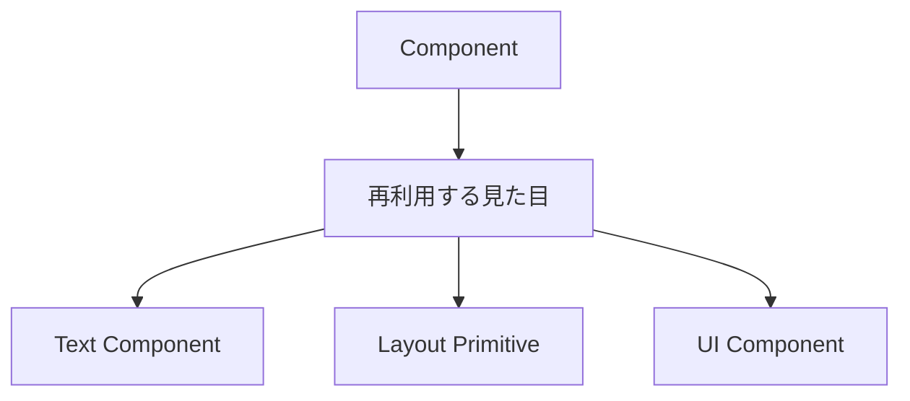
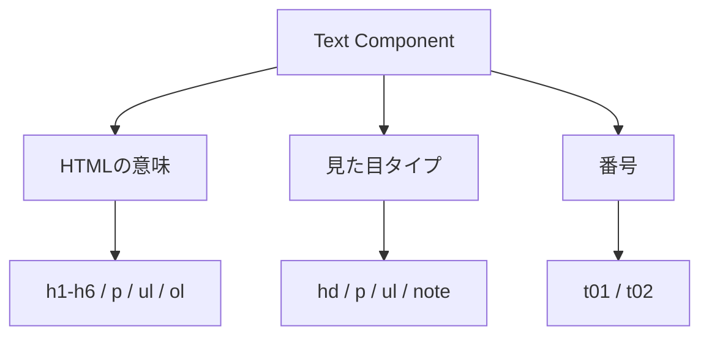
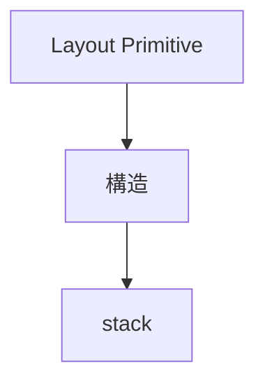
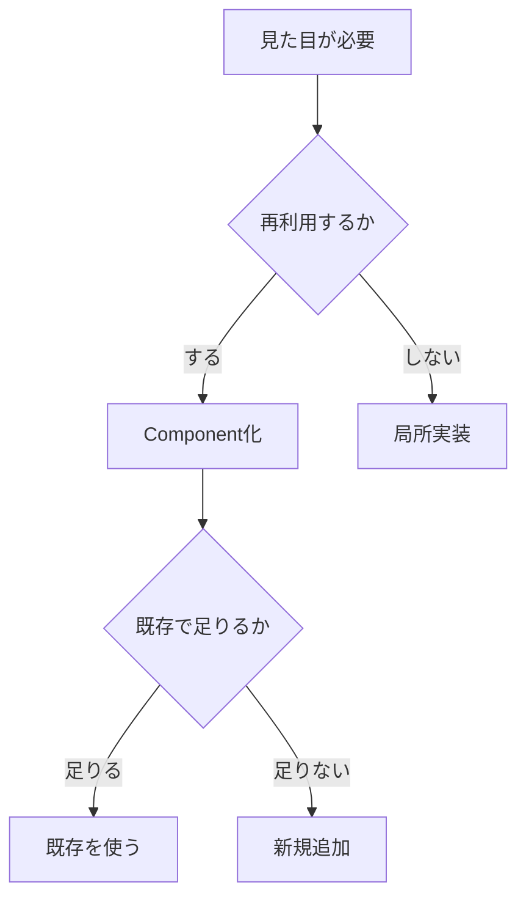

# 8. コンポーネント設計

## 8.1 結論



| 種類 | 扱い |
|---|---|
| [Text Component](#82-text-component) | 最初に作る。 |
| [Layout Primitive](#83-layout-primitive) | 最初に作る。 |
| UI Component | 必要になった時点で追加する。 |

## 8.2 Text Component



| 項目 | 内容 |
|---|---|
| HTML | 意味はHTML要素で持つ。 |
| class | [見た目タイプ](トークン設計.md#72-typography)を表す。 |
| `hd` | headingを表す。 |
| `t01` | type 01を表す。 |
| 注意 | `t01` は `h1` の意味ではない。 |
| 禁止 | 公開済み番号を別用途に再利用しない。 |

```html
<h2 class="text-hd-t01">見出しです。</h2>

<p class="text-p-t01">本文です。</p>

<ul class="text-ul-t01">
  <li>項目です。</li>
</ul>

<p class="text-note-t01">注記です。</p>
```

## 8.3 Layout Primitive



```css
@layer layout {
  .la_stack {
    display: flex;
    flex-direction: column;
    gap: var(--stack-space, var(--space-20));
  }
}
```

| 項目 | 内容 |
|---|---|
| 役割 | 縦方向の関係を作る。 |
| 余白 | [`--stack-space`](トークン設計.md#73-spacing) で変更する。 |
| 追加 | 必要になった時点で追加する。 |

## 8.4 追加判断



| 判断 | 対応 |
|---|---|
| 再利用しない。 | コンポーネント化しない。 |
| 既存で足りる。 | 既存を使う。 |
| 既存で足りない。 | [目的](目的.md)と用途を書いて追加する。 |

---

## ページリンク

- [戻る: index](index.md)
