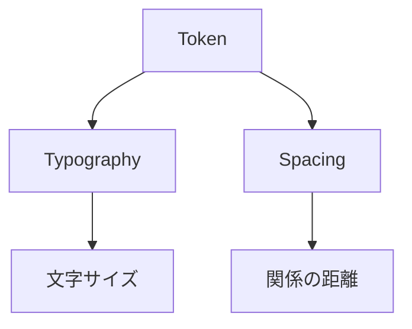
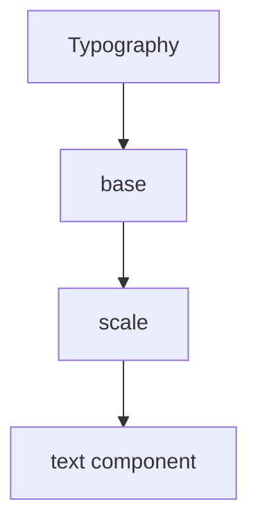
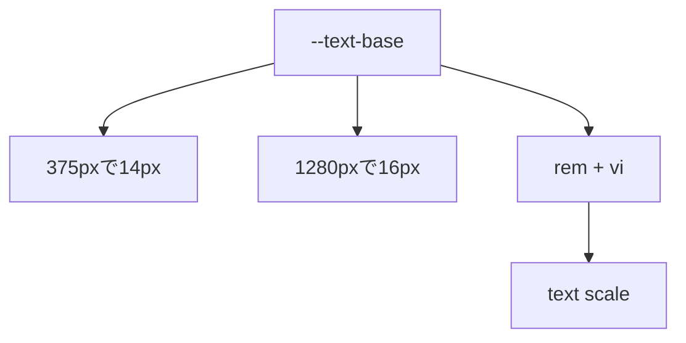
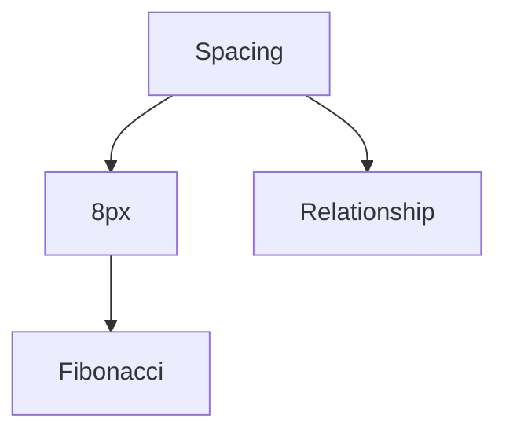
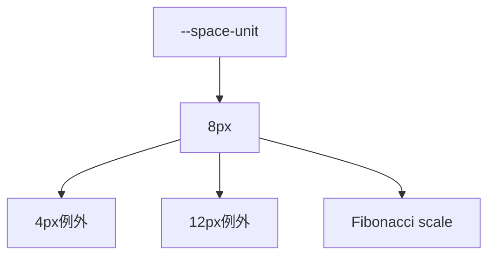

# 7. トークン設計

## 7.1 結論



| トークン | 内容 |
|---|---|
| [Typography](#72-typography) | 文字サイズを体系化する。 |
| [Spacing](#73-spacing) | 要素同士の関係を体系化する。 |

## 7.2 Typography



| 項目 | 内容 |
|---|---|
| 選択元 | `--text-*` から選ぶ。 |
| 基準 | `--text-base`。 |
| 基本定義 | `rem + vi` で定義する。 |
| 例外 | コンポーネント固有の文字サイズだけ `rem + cqi` を検討する。 |

### 7.2.1 Typography仕様



| 項目 | 仕様 |
|---|---|
| `--text-base` | 375pxで14px、1280pxで16pxにする。 |
| 定義 | `clamp(0.875rem, 0.8232rem + 0.221vi, 1rem)` |
| `--text-md` | `--text-base` と同じ。 |
| 小さい文字 | `--text-2xs`、`--text-xs`、`--text-sm` を使う。 |
| 大きい文字 | `--text-lg` 以上を使う。 |
| 連動 | `--text-base` が流動すると、全スケールが連動する。 |

### 7.2.2 流動単位

| 単位 | 見る対象 | 使う場面 |
|---|---|---|
| `rem` | ユーザーの基本文字サイズ。 | 文字サイズの基礎。 |
| `vi` | ページ全体のinline幅。 | `--text-base` の流動成分。 |
| `cqi` | [コンテナ](実装ルール.md#93-container)のinline幅。 | コンポーネント固有の見出し。 |

- `vi` だけで文字サイズを作らない。
- `cqi` だけで文字サイズを作らない。
- `clamp()` で最小値と最大値を固定する。
- 基本スケール全体を `cqi` で作らない。

```css
@layer tokens {
  :root {
    --font-body: system-ui, sans-serif;
    --text-base: clamp(0.875rem, 0.8232rem + 0.221vi, 1rem);
    --text-sm: calc(var(--text-base) * 8 / 9);
    --text-md: var(--text-base);
    --text-xl: calc(var(--text-base) * 8 / 6);
    --text-3xl: calc(var(--text-base) * 8 / 4);
  }
}
```

## 7.3 Spacing



| 項目 | 内容 |
|---|---|
| 選択元 | `--space-*` から選ぶ。 |
| 基準 | `--space-unit`。 |
| 基準値 | 8px。 |
| レスポンシブ | PC版とSP版で別スケールを作らない。 |
| 例外 | 必要な場合だけコンテナサイズで使うトークンを切り替える。 |

### 7.3.1 Spacing仕様



| 項目 | 仕様 |
|---|---|
| `--space-unit` | 8px。 |
| `--space-5` | 4px。 |
| `--space-15` | 12px。 |
| `--space-10` 以上 | 8pxベースのフィボナッチスケール。 |
| レスポンシブ | PC版とSP版で別スケールを作らない。 |
| 例外 | 必要な場合だけコンテナサイズで使うトークンを切り替える。 |

### 7.3.2 Spacing判断

| 問い | 判断 |
|---|---|
| アイコンと文字の隙間か。 | `--space-5` を使う。 |
| 小さな部品内の余白か。 | `--space-10` または `--space-15` を使う。 |
| 通常の要素間か。 | `--space-20` を使う。 |
| [見出しと本文](コンポーネント設計.md#82-text-component)の関係か。 | `--space-20` または `--space-30` を使う。 |
| 別グループとの区切りか。 | `--space-40` 以上を使う。 |
| セクション同士か。 | `--space-50` 以上を使う。 |

```css
@layer tokens {
  :root {
    --space-unit: 0.5rem;
    --space-5: calc(var(--space-unit) * 0.5);
    --space-10: var(--space-unit);
    --space-15: calc(var(--space-unit) * 1.5);
    --space-20: calc(var(--space-unit) * 2);
    --space-30: calc(var(--space-unit) * 3);
    --space-40: calc(var(--space-unit) * 5);
    --space-50: calc(var(--space-unit) * 8);
    --space-60: calc(var(--space-unit) * 13);
  }
}
```

## 7.4 関係

| 関係 | トークン | 例 |
|---|---|---|
| 密接 | `--space-5` | アイコンとラベル。 |
| 近い | `--space-10` | ラベルと入力欄。 |
| 小さい余白 | `--space-15` | 小さい部品内の間隔。 |
| 通常 | `--space-20` | カード内の要素。 |
| グループ | `--space-30` | 見出しと本文。 |
| 区切り | `--space-40` | カード同士。 |
| 大きな区切り | `--space-50` 以上 | セクション同士。 |

## 7.5 禁止事項

- 文字サイズを場当たり的に追加しない。
- 余白を場当たり的に追加しない。
- PC版とSP版で別スケールを作らない。
- marginの相殺に依存しない。
- 上下両方のmarginで余白を作らない。
- `line-height`、`half-leading`、`measure` を[基本ルール](基本思想.md)として再導入しない。

## 7.6 参考

| 種類 | 参照 |
|---|---|
| Typography / Spacing | [鈴木丈「音楽、数学、タイポグラフィ」 \| ÉKRITS / エクリ](https://ekrits.jp/2020/02/3309/) |
| Typography / Spacing | [余白とタイポグラフィのスケーリング設計 - CSS Notes](https://css-notes.com/layout/typography-scaling/) |
| Fluid Type | [Responsive and fluid typography with Baseline CSS features \| web.dev](https://web.dev/articles/baseline-in-action-fluid-type) |
| CSS Units | [CSS Values and Units Module Level 4 \| W3C](https://www.w3.org/TR/css-values-4/#viewport-relative-lengths) |
| CSS Units | [`<length>` CSS type \| MDN](https://developer.mozilla.org/en-US/docs/Web/CSS/Reference/Values/length) |
| Fluid Scale | [Fluid Responsive Design \| Utopia](https://utopia.fyi/) |
| Fluid Scale | [Utopia Core SCSS \| npm](https://www.npmjs.com/package/utopia-core-scss) |

---

## ページリンク

- [戻る: index](index.md)
