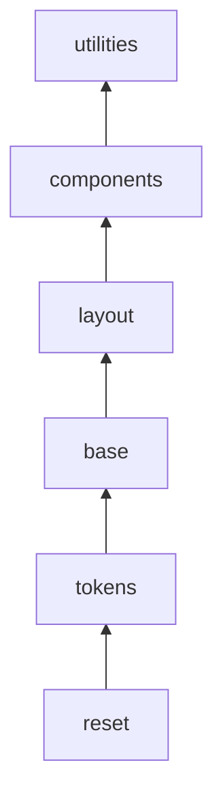
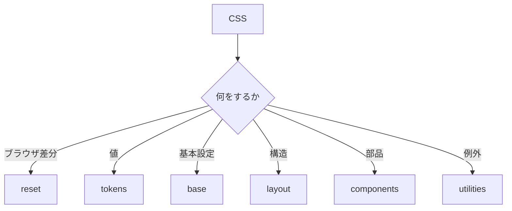
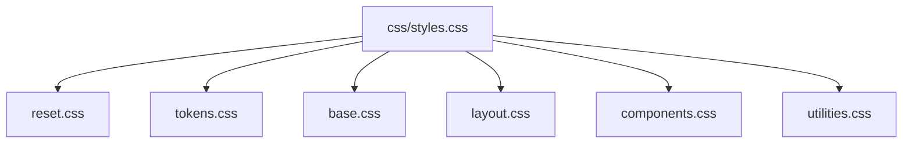

# 6. レイヤー設計

## 6.1 結論



- CSSは、6つのレイヤーに分ける。
- レイヤーは、責務と優先順位を固定する。
- 未レイヤーCSSは書かない。

## 6.2 レイヤー順

```css
@layer reset, tokens, base, layout, components, utilities;
```

| レイヤー | 役割 |
|---|---|
| `reset` | ブラウザ差分を整える。 |
| [`tokens`](トークン設計.md) | 値を定義する。 |
| `base` | 基本文字設定を定義する。 |
| [`layout`](コンポーネント設計.md#83-layout-primitive) | 構造を定義する。 |
| [`components`](コンポーネント設計.md) | UI部品を定義する。 |
| `utilities` | 例外を定義する。 |

## 6.3 判断



## 6.4 ファイル構造



```css
@layer reset, tokens, base, layout, components, utilities;

@import url("./reset.css") layer(reset);
@import url("./tokens.css") layer(tokens);
@import url("./base.css") layer(base);
@import url("./layout.css") layer(layout);
@import url("./components.css") layer(components);
@import url("./utilities.css") layer(utilities);
```

- 入口は、`css/styles.css` にする。
- `@import` では、必ず `layer()` を指定する。
- 各ファイルは、[1つの責務](基本思想.md#32-判断原則)だけを持つ。

## 6.5 完了条件

- レイヤー順が定義されている。
- すべてのCSSがレイヤー内にある。
- importに `layer()` が指定されている。
- ファイルの責務が分かれている。

---

## ページリンク

- [戻る: index](index.md)
