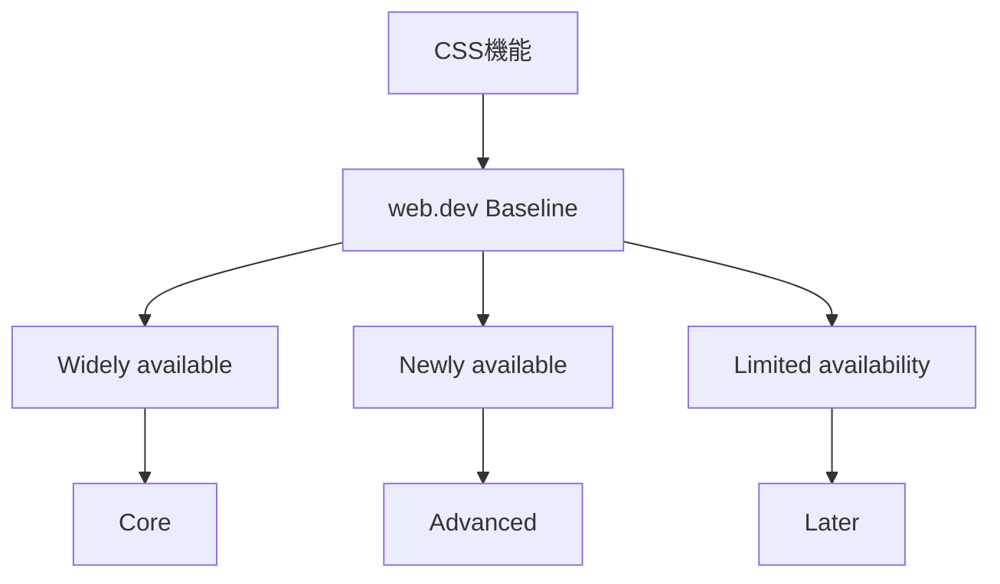
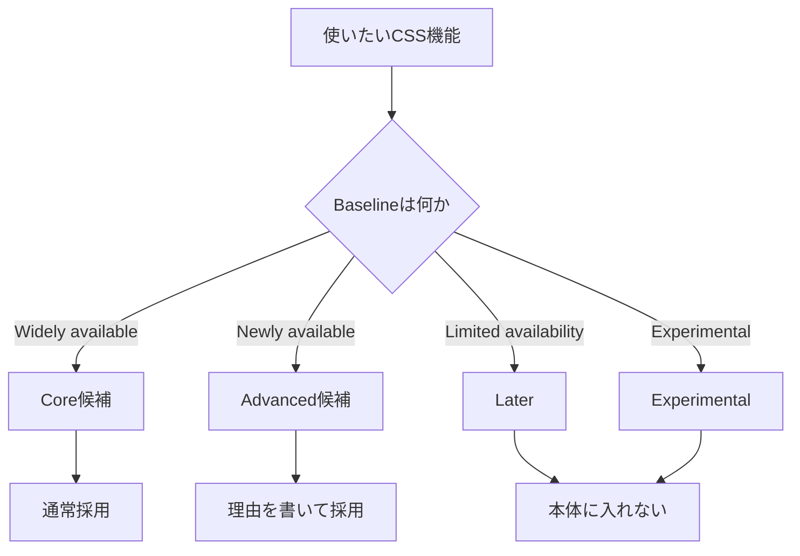

# 4. 判断基準

## 4.1 結論

- CSS機能の採用判断は、web.dev Baselineを基準にする。
- Coreは、原則としてBaseline Widely availableで構成する。
- Newly availableは、必要に応じてAdvancedとして扱う。
- Limited availabilityは、Laterとして扱う。

## 4.2 分類

| 分類 | 採用ライン | 扱い |
|---|---|---|
| Core | Baseline Widely available | 通常実装で使う。 |
| Advanced | Baseline Newly available | 必要な場合だけ使う。 |
| Later | Limited availability | 本体に入れない。 |
| Experimental | 実験的機能 | 隔離して扱う。 |

## 4.3 採用フロー

- Coreは、通常採用してよい。
- Advancedは、採用理由を書く。
- Laterは、本体に入れない。
- Experimentalは、本体に入れない。

## 4.4 現時点の扱い

| 機能 | 扱い |
|---|---|
| [`@layer`](レイヤー設計.md) | Core候補。 |
| [CSS Nesting](実装ルール.md#92-nesting) | Core候補。 |
| [`@container`](実装ルール.md#93-container) | Core候補。 |
| [`:has()`](実装ルール.md#94-state) | Advanced候補。 |
| [`@scope`](実装ルール.md#92-nesting) | Advanced候補。 |

- Baseline状態は、実装前に確認する。
- Core候補は、Widely availableであることを確認して使う。
- Advanced候補は、[必要性](実装ルール.md#96-完了条件)を明記して使う。

## 4.5 参考

| 種類 | 参照 |
|---|---|
| Baseline | [Baseline \| web.dev](https://web.dev/baseline) |

---

## ページリンク

- [戻る: index](index.md)
