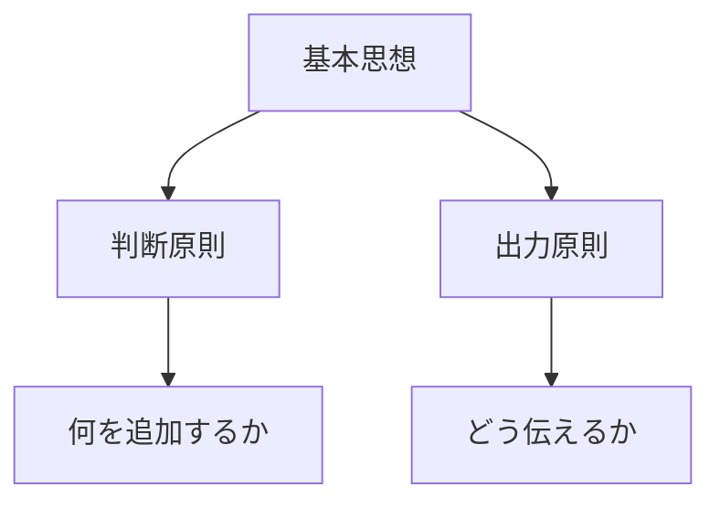
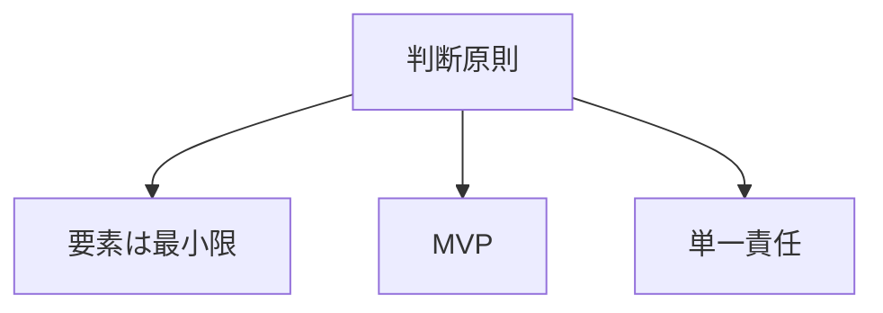
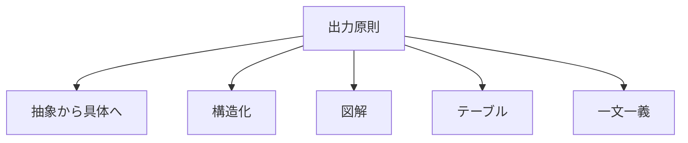
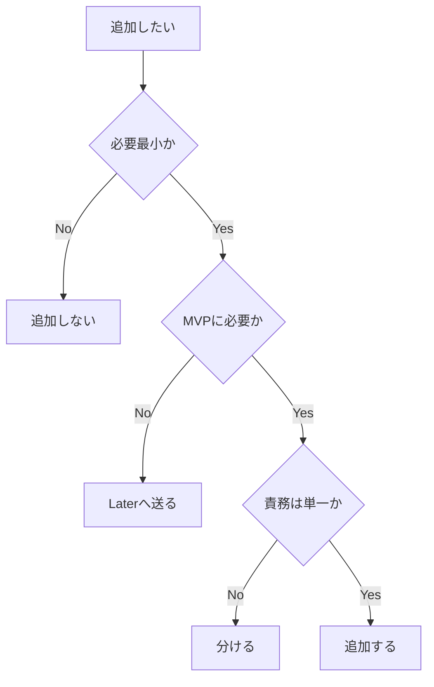

# 3. 基本思想

## 3.1 結論

- 基本思想は、すべての判断の前提である。
- 基本思想は、ドキュメント作成、[CSS設計](設計原則.md)、[CSS実装](実装ルール.md)に適用する。

## 3.2 判断原則

| 原則 | 内容 | 判断 |
|---|---|---|
| 要素は最小限 | 必要な概念だけを残す。 | 追加する前に削れるものを見る。 |
| MVP | まず成立する最小機能を作る。 | 初期段階では必要最小にする。 |
| [単一責任](レイヤー設計.md#63-判断) | 1つの要素に1つの主な役割を持たせる。 | 役割が混ざる場合は分ける。 |

## 3.3 出力原則

| 原則 | 内容 | 判断 |
|---|---|---|
| 抽象から具体へ | 目的、全体像、判断、実装の順に書く。 | 先に結論と関係を示す。 |
| 構造化 | 要点を見出し、図、表に分ける。 | 情報の役割を見える化する。 |
| 図解 | 関係や流れをmermaidで表す。 | 文章より図が短い場合に使う。 |
| テーブル | ラベル、内容、比較、対応を表にする。 | 並列情報がある場合に使う。 |
| 一文一義 | 1つの文に1つの意味だけを書く。 | 読み違いを減らす。 |

## 3.4 判断フロー

- 必要最小でないものは、追加しない。
- MVPに不要なものは、[Later](判断基準.md#42-分類)へ送る。
- 責務が混ざるものは、分ける。
- 追加する場合は、目的と責務を書く。

## 3.5 禁止事項

| 禁止 | 理由 |
|---|---|
| 便利そうという理由だけで追加する。 | 目的が弱くなる。 |
| 1つの章に複数の目的を混ぜる。 | 読む順番が壊れる。 |
| 1つのクラスに複数の責務を混ぜる。 | 再利用と修正が難しくなる。 |
| MVP前に拡張設計を増やす。 | 初期実装が重くなる。 |

---

## ページリンク

- [戻る: index](index.md)
