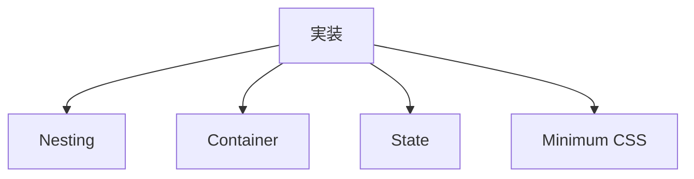
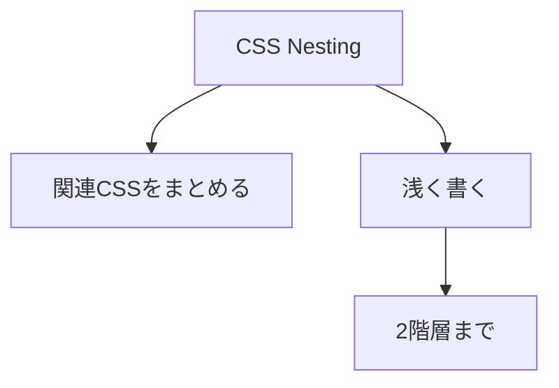
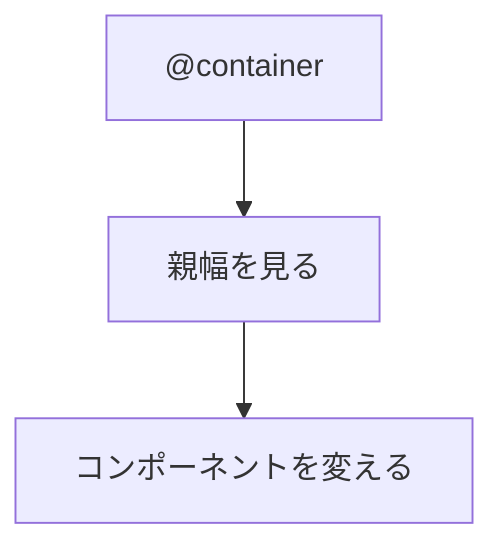
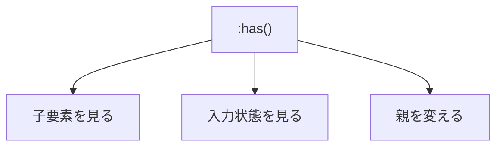

# 9. 実装ルール

## 9.1 結論



| 対象 | 内容 |
|---|---|
| [Nesting](#92-nesting) | 関連CSSを浅くまとめる。 |
| [Container](#93-container) | 親幅でコンポーネントを変える。 |
| [State](#94-state) | 子要素や状態で親を変える。 |
| Minimum CSS | 最小構成で確認する。 |

## 9.2 Nesting



| 項目 | 内容 |
|---|---|
| 目的 | 関連CSSを浅くまとめる。 |
| 深さ | 原則2階層までにする。 |
| 子要素 | できるだけ `>` を使う。 |
| `&` | 状態、属性、修飾に使う。 |
| 注意 | [`@scope`](判断基準.md#44-現時点の扱い) の完全な代替にしない。 |

## 9.3 Container



| 項目 | 内容 |
|---|---|
| 使う場面 | [コンポーネント](コンポーネント設計.md)単位の変化。 |
| 見る対象 | 画面幅ではなく親要素の幅。 |
| 必須設定 | 親要素に `container-type` を付ける。 |
| 注意 | 条件を増やしすぎない。 |

## 9.4 State



| 項目 | 内容 |
|---|---|
| 子要素 | 子要素の有無で変わる場合に検討する。 |
| 入力状態 | 入力状態で親を変える場合に検討する。 |
| 扱い | [Advanced候補](判断基準.md#42-分類)。 |
| 事前確認 | [Baseline状態](判断基準.md)と必要性を確認する。 |
| 探索範囲 | できるだけ狭くする。 |
| 禁止 | `body` や `:root` に乱用しない。 |

## 9.5 最小CSS

```css
@layer reset, tokens, base, layout, components, utilities;

@layer tokens {
  :root {
    --font-body: system-ui, sans-serif;
    --text-base: clamp(0.875rem, 0.8232rem + 0.221vi, 1rem);
    --text-sm: calc(var(--text-base) * 8 / 9);
    --text-md: var(--text-base);
    --text-3xl: calc(var(--text-base) * 8 / 4);

    --space-unit: 0.5rem;
    --space-10: var(--space-unit);
    --space-20: calc(var(--space-unit) * 2);
    --space-30: calc(var(--space-unit) * 3);
  }
}

@layer base {
  body {
    font-family: var(--font-body);
    font-size: var(--text-md);
  }
}

@layer layout {
  .la_stack {
    display: flex;
    flex-direction: column;
    gap: var(--stack-space, var(--space-20));
  }

  .la_card-container {
    container-type: inline-size;
  }
}

@layer components {
  .text-hd-t01 {
    font-size: var(--text-3xl);
    text-wrap: balance;
  }

  .card {
    --card-space: var(--space-20);
    display: grid;
    gap: var(--card-space);
    padding: var(--card-space);

    &:has(> img) {
      --card-space: var(--space-30);
    }

    @container (inline-size > 40rem) {
      --card-space: var(--space-30);
    }
  }
}
```

## 9.6 完了条件

- CSSが[レイヤー](レイヤー設計.md)内にある。
- 値が[トークン](トークン設計.md)から選ばれている。
- Nestingが浅い。
- `@container` を使う場合は、親要素に `container-type` がある。
- `:has()` を使う場合は、必要性と探索範囲が明確である。
- `!important` がない。

## 9.7 参考

| 種類 | 参照 |
|---|---|
| Baseline | [Baseline \| web.dev](https://web.dev/baseline) |
| Nesting | [Nesting \| Web Platform Features Explorer](https://web-platform-dx.github.io/web-features-explorer/features/nesting/) |
| Nesting | [CSS nesting - CSS \| MDN](https://developer.mozilla.org/en-US/docs/Web/CSS/Guides/Nesting) |

---

## ページリンク

- [戻る: index](index.md)
