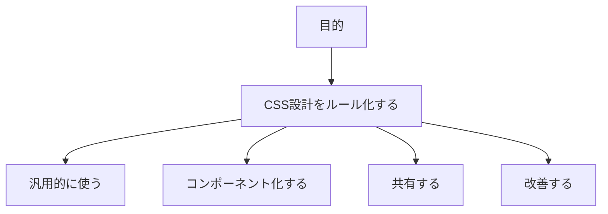
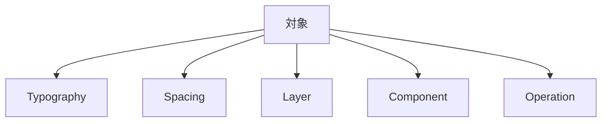
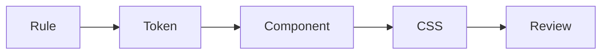

# 1. 目的

## 1.1 結論

- CSS設計2026版の目的は、CSS設計を共有可能なルールにすることである。
- この設計は、個人作業だけでなく、複数案件とチーム作業に使う。
- この設計は、AIエージェントが自律的に実装判断できる状態を作る。

## 1.2 対象

| 対象 | 内容 |
|---|---|
| [Typography](トークン設計.md#72-typography) | 文字サイズを体系化する。 |
| [Spacing](トークン設計.md#73-spacing) | 要素同士の関係を体系化する。 |
| [Layer](レイヤー設計.md) | CSSの責務を分ける。 |
| [Component](コンポーネント設計.md) | 再利用する見た目を部品化する。 |
| [Operation](設計原則.md) | 人とAIの作業手順を共有する。 |

## 1.3 成果

| 成果 | 内容 |
|---|---|
| [Rule](判断基準.md) | 判断基準を持つ。 |
| [Token](トークン設計.md) | 値を再利用可能にする。 |
| [Component](コンポーネント設計.md) | 見た目を再利用可能にする。 |
| [CSS](実装ルール.md) | ルールの実装結果である。 |
| [Review](設計原則.md#52-6原則) | ルール改善の入口である。 |

## 1.4 初期範囲外

| 範囲外 | 理由 |
|---|---|
| すべてのCSS機能を扱う。 | 判断基準が弱くなる。 |
| すべてのUI部品を最初から作る。 | 初期範囲が広がりすぎる。 |
| `DESIGN.md` を原本にする。 | docsとの責務が混ざる。 |

---

## ページリンク

- [戻る: index](index.md)
