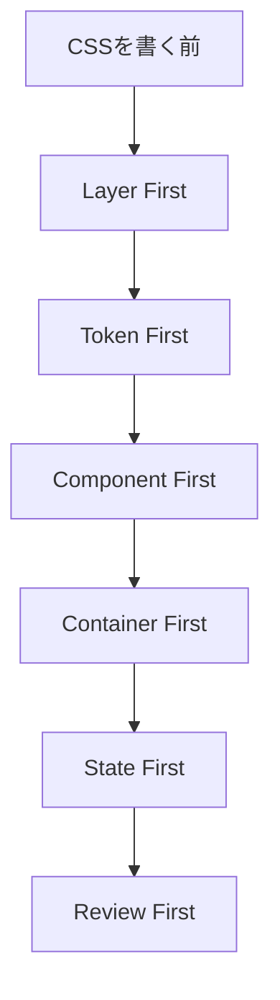
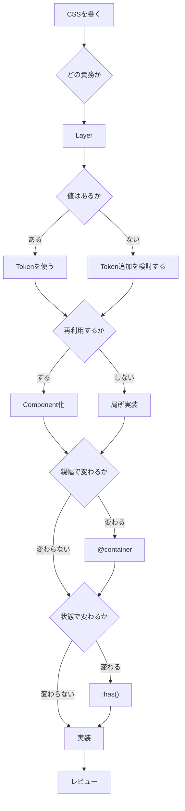

# 5. 設計原則

## 5.1 結論

- CSSを書く前に、判断順を固定する。
- 判断順を固定すると、人とAIの実装差が減る。

## 5.2 6原則

| 原則 | 意味 |
|---|---|
| [Layer First](レイヤー設計.md) | 先にCSSの所属レイヤーを決める。 |
| [Token First](トークン設計.md) | 値はトークンから選ぶ。 |
| [Component First](コンポーネント設計.md) | 再利用する見た目は部品化する。 |
| [Container First](実装ルール.md#93-container) | 画面幅より親幅を優先する。 |
| [State First](実装ルール.md#94-state) | 子要素や状態をCSSで読む。 |
| Review First | 実装後にルールとのズレを見る。 |

## 5.3 判断図

## 5.4 禁止事項

- [未レイヤーCSS](レイヤー設計.md)を書かない。
- [値](トークン設計.md)を場当たり的に増やさない。
- 深いセレクタを書かない。
- 深い[Nesting](実装ルール.md#92-nesting)を書かない。
- `!important` を原則使わない。
- IDセレクタでスタイルを書かない。

---

## ページリンク

- [戻る: index](index.md)
